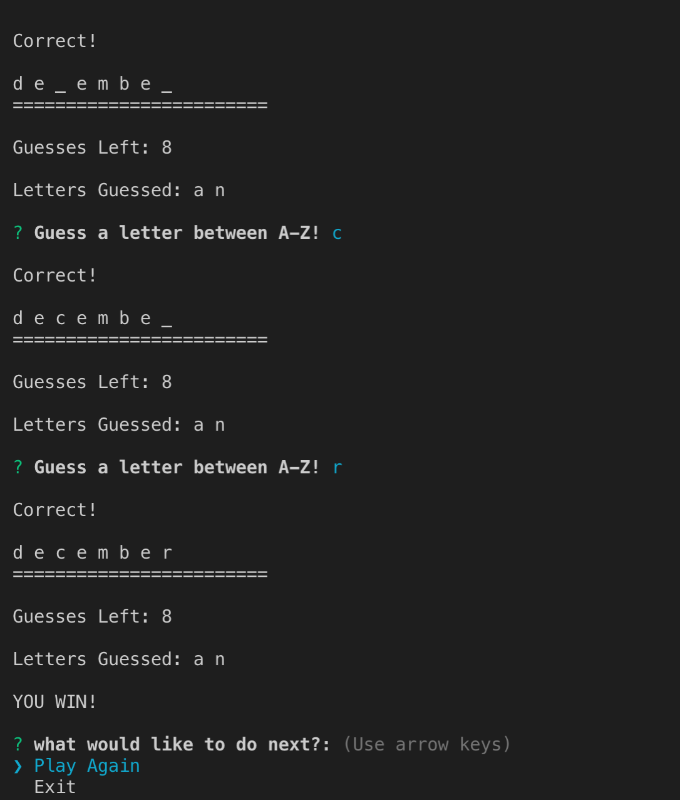

# Constructor-Word-Guess
Advanced JavaScript Assignment: 

 
This Constructor-word-guess utilizes three Javascript files:  
1.Letter.js: 
The letter.js file holds a constructor for letters in word.  
2.word.js: 
The word.js file holds the constructor for word object consisting of letter objects. 
3.Index.js: 
The index.js file holds the logic for the game.It utilizes the Inquirer NPM to get input. The program will pick a word at random out of months array and the user must guess the letters in the word.The game progress if the user keep guessing the correct letters. If the user guess a wrong letter,he/she will will lose an attempt. The user will be given a total of 10 attemps to finish the game. The game will count both the wrong or wright letters and update the user. Whether the user win or loose, he/she will be given another chance either to restart or exit out of the game. If the user decided to play again, the game will restart otherwise it will exit out of the game.

