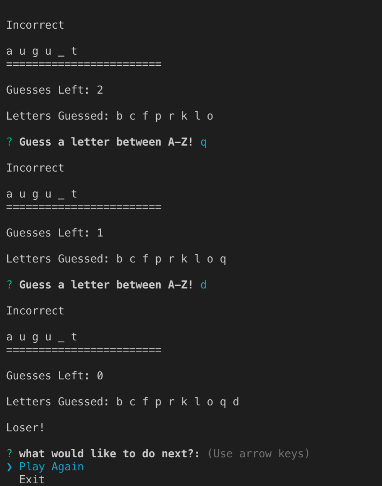

# Constructor-Word-Guess
Advanced JavaScript Assignment: 

 
This Constructor-word-guess utilizes three Javascript files:  
1.Letter.js: 
The letter.js file holds a constructor for letters in word., one to hold the constructor for a word object consisting of letter objects, and the main file (index.js) which utilizes the Inquirer NPM to get input. The program will pick a word at random out of the word bank and the user must guess the letters in the word (only letters, no special characters or numbers). If correct, the user continues guessing. If the guess is wrong, the user will lose an attempt (starting from 10). The game will let the user know if the word is fully guessed or if the number of incorrect guesses have been used up. Either way, the correct word will be known and the user will be asked if they want to play again. If so, a new word is chosen and the game begins anew. Otherwise, the program ends.

